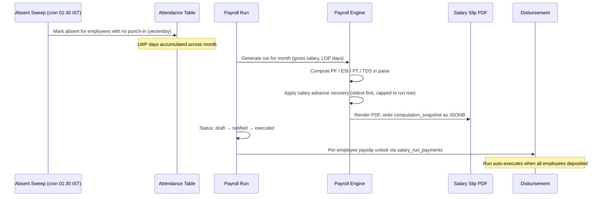
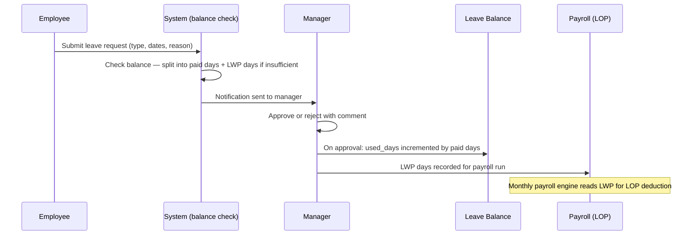
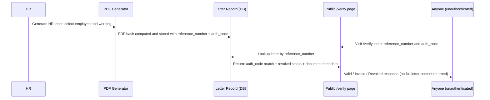

# Hire'in Solutions — New Hire Handover Document (PO & QA)

This document is intended for a new Product Owner or QA Engineer joining the Hire'in Solutions team. Read it cover to cover in one sitting before touching the codebase or the admin portal. It is a working reference, not a welcome packet.

Companion documents:

- `docs/onboarding/FEATURE_TIERS.md` — prioritized feature classification (P0–P3) and MLP definition
- `docs/onboarding/QA_GUIDE.md` — QA-specific test running, bug triage, and coverage map

---

## 1. Product Overview and Strategic Context

Hire'in Solutions is an AI-powered staffing and talent acquisition firm operating in four service verticals: Healthcare, IT, Engineering, and Professional Services. The company places candidates with client organizations and manages its own internal workforce of recruiters, account managers, HR, and operations staff.

The platform solves two distinct problems simultaneously.

For the company's external clients and candidates: a public-facing website with live job listings, capability decks, vertical landing pages, and a public letter verification portal. Candidates apply, receive offers, and sign employment documents entirely through the platform.

For the company's internal team: a comprehensive admin portal that covers the full employee lifecycle from offer generation through daily attendance, payroll, performance management, training compliance, and offboarding. Every person who works at Hire'in Solutions uses this portal every working day.

The north star for the product is to eliminate the operational friction that staffing firms typically manage through spreadsheets and email chains. Every workflow that previously required a manual handoff — offer letter approvals, leave approvals, payslip distribution, SOP acknowledgements — should have a tracked, auditable, role-appropriate in-system flow.

### DACI Ownership Map

| Decision area | Driver | Approver | Contributors | Informed |
|---|---|---|---|---|
| Feature prioritization | Product Owner | CEO / super_admin | Engineering, HR | All staff |
| Schema changes | Engineering | super_admin | HR (data requirements) | Finance, Executive |
| RBAC and access policy | super_admin | CEO | HR, Engineering | All roles |
| Payroll configuration | executive / HR | super_admin | Finance | Employee |
| Content and marketing | marketing_manager | admin | content_creator, reviewer | All |

---

## 2. User Personas and Role Matrix

### Role Descriptions

**super_admin** — The system owner. Has unrestricted access to every feature, including TOTP reset, soft-delete, feature flag management, schema drift checks, and final salary advance approval. In practice, this is the CEO or the founding technical lead. There should be at most two super_admin accounts in production.

**admin** — Operational administrator with near-full access. Can manage users, approve offer letters, generate payroll, configure settings. Cannot disable TOTP or hard-delete records. The most common elevated role for day-to-day HR operations leadership.

**executive** — Read-plus-write access to the India payroll engine, salary structures, statutory exports, and the executive cockpit. Cannot manage users or approve offer letters. Intended for the finance lead or COO who runs the monthly payroll run without needing full admin access.

**hr** — HR generalist. Can manage leave, attendance oversight, generate letters, run accruals, configure holidays, and manage onboarding. Cannot approve offer letters (requires admin or above) or access payroll salary structures directly. The day-to-day HR team role.

**finance** — Read access to salary slips, payroll reports, and statutory exports. Can regenerate salary slips for individual employees. Cannot modify employee records or run payroll.

**operations** — Cross-functional operations staff. Can view and manage job listings, contacts, contracts, leave and attendance for their team, and the help desk queue. Typically used for account managers and delivery managers.

**manager** — Team lead responsible for a group of direct reports. Approves leaves, views team attendance, manages performance plans, initiates offer letters, and has read access to direct-report salary changes. Cannot access payroll or letter generation directly.

**recruiter** — Focused on recruitment pipeline. Can view and manage job listings, applications, contacts, and submit candidates to Ceipal ATS. No HR portal access beyond the recruitment tab.

**employee** — Standard staff member. Can punch in/out, apply for leave, download their own salary slips, view their training track, raise help desk tickets, and request salary advances. No visibility into other employees' data.

**Studio add-ons** — Any user can have a `studioAddOn` field set to `marketing_manager`, `content_creator`, or `influencer`. This grants Content Studio access on top of their base role without changing their HR portal access.

### Role x Module Access Matrix

| Module | super_admin | admin | executive | hr | finance | operations | manager | recruiter | employee |
|---|---|---|---|---|---|---|---|---|---|
| Attendance oversight | R/W | R/W | — | R/W | — | R | R (own team) | — | R (own) |
| Leave management | R/W | R/W | — | R/W | — | R/W (own team) | R/W (own team) | — | Apply only |
| Payroll run and slips | R/W | R/W | R/W | R | R | — | — | — | Download own |
| Salary structures | R/W | R/W | R/W | R/W | R | — | — | — | — |
| Offer letters | R/W | R/W | — | Generate/track | — | — | Generate | — | Receive/sign |
| HR letters | R/W | R/W | — | R/W | — | — | — | — | Receive |
| Addendum letters | R/W | R/W | — | R/W | — | — | R/W | — | Sign |
| Performance | R/W | R/W | — | R/W | — | R/W | R/W (own team) | — | Own goals |
| SOPs | R/W | R/W | — | R/W | — | R/W | R/W | — | — |
| Training | R/W | R/W | — | R/W | — | R/W | R/W | — | Own track |
| Salary advance | R/W | R/W | — | R/W | R | R | Approve (team) | R | Request own |
| Job listings | R/W | R/W | — | — | — | R/W | R/W | R/W | — |
| Contracts/finance | R/W | R/W | — | R/W | R | R/W | — | — | — |
| Content Studio | R/W | R/W | — | — | — | — | — | — | — |
| Vault | R/W | R/W | — | R | — | R | R | R | R |
| Help Desk | R/W | R/W | — | R/W | Queue | R/W | R/W (team) | Own | Own |
| Control Tower | Full | — | — | Data maint. | — | — | — | — | — |
| Feature flags | R/W | R/W | — | R | — | — | — | — | — |
| User management | R/W | R/W | — | R/W | — | — | R (create) | — | — |

### Two-Tier Gate for the v2 App Redesign

The v2 redesign (`new_look` flag) operates through two gates that must both be true before a user sees the new interface:

1. The global `new_look` feature flag in `system_settings` must be ON (controlled by super_admin or admin — this is the master kill-switch).
2. The individual user's `preferences.newLook` must be `true` (set per user via their profile).

The `useNewLook()` hook composes both conditions. A user with `preferences.newLook = true` will still see the classic interface if the global flag is OFF.

---

## 3. Public Site Map

All public pages are served at the root domain (hire-in.com). They are accessible without authentication.

| Path | Purpose | Key interactions |
|---|---|---|
| `/` | Homepage — company overview and service verticals | CTA buttons to contact and job board |
| `/jobs` | Live job board | Ceipal-synced listings; filter by specialty/location; Apply button per job |
| `/jobs/:id` | Job detail page | Full description; application form (name, email, phone, resume, cover letter, LinkedIn) |
| `/services/it-staffing` or `/it-staffing` | IT Staffing vertical landing page | Hero section, stats strip, interactive slide viewer, PDF/PPT download |
| `/services/healthcare` | Healthcare staffing landing page | Service overview, contact CTA |
| `/services/engineering` | Engineering staffing landing page | Service overview |
| `/services/professional-services` | Professional services landing page | Service overview |
| `/insights` | Blog and thought leadership | Article list; links to full posts |
| `/it-capability-deck` | IT capability deck with slide viewer | Slide-by-slide view; PDF and PPT download |
| `/healthcare-capability-deck` | Healthcare capability deck | Slide-by-slide view; PDF and PPT download |
| `/verify` | Public letter verification portal | Enter reference number and auth code; returns letter validity and metadata |
| `/contact` | General contact form | Inquiry type, name, email, phone, company, message |
| `/sms-consent-disclosure` | SMS marketing consent disclosure | Static legal page |

The `/verify` page is security-sensitive. It must only confirm that a document with the given reference number has the given auth code and was not revoked or tampered with. It must never display the full letter content to an unauthenticated user.

---

## 4. Admin Portal — Module-by-Module Walkthrough

All admin portal pages are under `/admin`. Authentication is required. Role-based access is enforced at both the API and UI layers.

---

### 4.1 My Desk / Command Center

**What it does.** The primary daily interface for every employee. Replaced the earlier tab-based My Work page. The live dashboard is `CommandCenter` (the older `MyWork` and `HRDashboard` components are no longer the entry point).

**Who uses it.** All roles, with the view adapting by role. Managers and HR see a "Your Team Today" pulse card with present/absent/on-leave/pending-leave counts. Employees see their personal attendance, leave balance, and the break widget.

**Key flows.**
1. Employee opens `/admin` (redirects to `/admin/hr`), sees their Time Card.
2. Employee clicks Punch In — attendance record created with `punchIn` timestamp.
3. Employee clicks Start Lunch Break — `break_records` row created; live timer starts.
4. Employee clicks End Break, then Punch Out — `punchOut` timestamp written; daily record complete.
5. Manager sees team on-lunch / on-tea status badges in the Team Attendance view.

**P-tier.** MLP. Punch in/out is P1. Break tracking is P1. The pulse card for managers is P1.

**What breaks if this is down.** Employees cannot record their working time. The nightly absent sweep will mark present employees as absent. Payroll LOP will be incorrect.

**Who owns it.** hr and manager roles for oversight. super_admin for configuration.

---

### 4.2 HR and People Management

**What it does.** The core HR operating layer. Covers employee directory, attendance oversight, leave approval workflows, EL/SL accrual engine, holiday calendar, the New Hire section, employee exit management, and soft-delete.

**Who uses it.** hr, admin, super_admin for management. manager for team-level views. employee for self-service.

**Key flows — leave.**
1. Employee navigates to Leaves tab, clicks Apply.
2. Selects leave type, date range, reason. System checks balance.
3. Manager receives notification; opens Leave Approvals (P1 notification badge appears on page).
4. Manager approves or rejects with comment.
5. If approved: balance decremented, attendance records updated, LWP applied if balance insufficient.
6. Employee sees decision with reviewer name and timestamp.

**Key flows — accrual engine.**
- Monthly accrual runs for EL (15 days/year, conditional on 128 hours worked) and SL (8 days/year, unconditional beyond 30-day employment check).
- Year-end batch carries forward up to the EL carry-forward cap; excess lapses.
- LWP is gated: the system will not let an employee apply leave that exceeds their balance without splitting into a paid portion and an LWP portion.

**New Hire section (`/admin/new-hire`).** Three tabs:
- Offer Letters: OfferLetterGenerator for managers; OfferLettersDashboard for HR/admin tracking. Managers can generate and track; HR/admin can approve and countersign.
- Onboarding: Status table of employees joined within the last 90 days or with a null joining_date. Shows training percentage, documents uploaded, bank details status, and night-shift consent.
- Users: Inline user management panel (same as People & HR > Users).

**Accessible to:** super_admin, admin, hr, operations, manager. Employees do not see the New Hire section.

**Exit statuses.** `Relieved` (involuntary termination) and `Left Company` (voluntary resignation). Super_admin can soft-delete a user record (sets `deletedAt`). Soft-deleted users are hidden from all lists but their data is preserved.

**P-tier.** Leave application is P1. Leave approval is P1. Accrual engine correctness is P0 (drives payroll LOP). Exit statuses are P1. New Hire section is P1.

**What breaks if this is down.** Leave cannot be applied or approved. Balance deductions stop. LWP is not applied to payroll. New hire onboarding is not tracked.

**Who owns it.** hr for day-to-day operations. super_admin for configuration and soft-delete.

---

### 4.3 Letters and Documents

**What it does.** Generates, manages, and verifies all formal employee documents: HR letters (experience, internship, relieving), offer letters with a CEO approval hard-stop, five addendum types (salary revision, designation/promotion, combined, device allocation, standalone), and public document verification.

**Who uses it.** hr generates and issues. manager initiates offer letters. admin and super_admin approve. candidate receives and signs via public link. hr countersigns.

**Key flows — offer letter.**
1. Manager or HR opens New Hire > Offer Letters, clicks Generate.
2. Fills in candidate details, compensation, and joining date.
3. Submits for approval — status moves to `pending_approval`.
4. admin or super_admin reviews and approves (hard stop — no offer can skip this). Rejection reason is visible to the originating manager.
5. Candidate receives email with a public acceptance link.
6. Candidate reviews, types their name as e-signature, and submits. A cryptographic hash of the signed document is stored.
7. HR countersigns — offer letter status moves to `countersigned`.
8. Onboarding trigger fires: guided onboarding checklist created for the new employee.

**Key flows — HR letter.**
1. HR opens HR Tools > Letter Generator, picks letter type and employee.
2. Selects sentences from the wording matrix (controlled vocabulary).
3. Previews PDF, confirms, and issues. A reference number and auth code are generated.
4. PDF hash is stored. The letter can be verified at `/verify` using the reference number and auth code.
5. If the employee's name changes after issuance, a warning badge appears on the letter record prompting HR to re-issue.

**CC recipients.** HR can set CC email addresses on any letter before sending. The stored CC list is visible when viewing a sent letter's details and can be edited before re-sending.

**P-tier.** Offer letter e-sign chain is P0. Letter hash and `/verify` are P0. HR letter generator is P1. Addendums are P2.

**What breaks if this is down.** New hires cannot receive or sign employment offers. Issued letters cannot be verified. HR cannot produce standard employee documentation.

**Who owns it.** hr for generation and issuance. admin / super_admin for offer letter approval. super_admin for template and wording matrix configuration.

---

### 4.4 Attendance and Payroll Engine

**What it does.** The India statutory payroll engine computes PF (EPF at 12% employee / 12% employer), ESI (0.75% employee / 3.25% employer, applicable up to ₹21,000 gross, ₹25,000 for employees with disabilities), Professional Tax (state-specific), and TDS. All amounts are computed in paise (integer arithmetic) to avoid floating-point error. ESI rounds UP to the nearest paise.

**Key components.**
- Shift system (SHIFT_A, SHIFT_B, SHIFT_C with correct IST times seeded via ON CONFLICT DO UPDATE).
- Nightly absent sweep cron (01:30 IST, targets the previous day, shiftless employees skipped).
- Break tracking table (`break_records`).
- Attendance regularization tickets raised by employees, reviewed by manager or HR.
- Salary structures with component rules (Basic, HRA, Conveyance, LTA, Special Allowance, Residual).
- Monthly payroll run: generate → adjust → approve → execute → disburse.
- Salary slips as PDF with computation snapshot stored as JSONB on first render.
- Pay report dashboard with LOP summary, statutory exports (EPF, ESI, PT, TDS), and disbursement tracking.
- Salary advance request → manager approve → final approve (super_admin) → disbursed. Monthly recovery engine reconciles against the capped run-row amount (oldest advance first); shortfalls carry forward.
- Manual advance recording: super_admin, admin, and hr can backfill advances or record overpayments for any employee directly, even when `salary_advance_enabled` flag is OFF.

**LOP modes.** Two modes configurable per structure: `proportional` (components scale with worked days) and `fixed` (flat components unaffected by LOP). The `lop_basis` setting controls how working days are counted.

**P-tier.** Payroll computation engine is P0. Absent sweep is P0. Salary advance recovery in payroll run is P0. Salary slips download is P1. Pay report dashboard is P2. Manual advance recording is P2.

**What breaks if this is down.** Employees are not marked absent. Payroll deductions are wrong. Payslips cannot be generated. Salary advances are not recovered. Statutory compliance fails.

**Who owns it.** hr and executive for day-to-day payroll operations. super_admin for engine configuration and final advance approvals.

---

### 4.5 Performance Management

**What it does.** Goal tracking, performance check-ins, review cycles (self and manager reviews), 360 feedback, analytics, probation milestone tracking, coaching log entries, and growth plans. Gated by the `performance_management` feature flag (default OFF).

**Probation cadence.** Eight milestones: Day 1, Day 7, Day 15, Day 30, Day 45, Day 60, Day 75, Day 90. Each milestone has a check-in record. Managers receive prompts at each milestone.

**Growth plans.** Triggered by a signed growth-clause addendum. The acceptance and HR countersign activate a real tracked plan with goals and a timeline. Plans are seeded with `employee_id = NULL` at offer acceptance and populated on the employee's first login.

**Coaching log.** Ad-hoc manager notes attached to an employee's record. These are not the probation check-in milestones — they are free-form observations.

**P-tier.** All performance features are P2 (module is hidden when flag is OFF).

**What breaks if this is down.** Goal tracking and review cycles stop. Probation check-ins are not recorded. Growth plan activation does not fire.

**Who owns it.** hr for configuration and review cycle management. manager for team-level goals and check-ins. employee for self-reviews.

---

### 4.6 Training and SOPs

**What it does.** Two related but independent systems.

**Onboarding training catalog.** Structured learning tracks with sections, content, and quizzes. HR assigns tracks to employees. Employees complete their "My Training" view. A compliance lock activates when training is overdue — the employee cannot use certain system features until they complete their track. Managers can request due-date extensions; only super_admin can grant them. Gated by the `onboarding_training` flag.

**SOP library.** Standard Operating Procedures stored as versioned documents. Two-tier access gate: the `process_governance` master flag must be ON and the user must be in the rollout scope. Enforcement is either soft (a coaching banner) or hard (a compliance lock) depending on the SOP configuration. Published/active versions are immutable — editing clones a new draft. Wave rollout schedules: Wave 0 (exempt from the two-per-week operational cadence).

**SOP–goal linkage.** Goals can reference a specific SOP version via `linked_sop_id`. Roll-ups resolve across all version IDs of the same `sopMasterId`.

**P-tier.** Training catalog and compliance lock are P2. SOP library is P2. Wave rollout and soft/hard enforcement are P2.

**What breaks if this is down.** New hires cannot complete required training. The compliance lock does not activate or lift. SOP acknowledgements are not tracked.

**Who owns it.** hr for training track management and SOP governance. manager for team training progress. super_admin for extension grants.

---

### 4.7 Recruitment

**What it does.** Manages the external candidate pipeline through Ceipal ATS integration. Job listings are synced from Ceipal via JWT-authenticated API calls. Candidates who apply through the public job board have their applications pushed back to Ceipal.

**Key flows.**
1. Operations or recruiter triggers a Ceipal sync from Admin > Jobs.
2. Ceipal job data is pulled and upserted into the `jobs` table.
3. Candidate submits application via `/jobs/:id`.
4. Application is stored in `applications` table. `ceipalSyncStatus` starts as `pending`.
5. Operations or recruiter reviews application and triggers push to Ceipal — `ceipalApplicantId` is populated.
6. Shortlisted candidates proceed to the offer letter flow (see 4.3).

**P-tier.** Ceipal sync and applicant push are P2. The public job board is MLP/P1.

**What breaks if this is down.** Job listings become stale. Candidate applications are not forwarded to the ATS.

**Who owns it.** operations and recruiter for day-to-day pipeline. admin for Ceipal configuration.

---

### 4.8 Finance and Contracts

**What it does.** Client registry, MSA and SOW contract management, invoice tracking, and the executive cockpit. Contracts can be dispatched to clients for signature.

**Who uses it.** hr, operations, finance for contract management. executive and super_admin for the cockpit and approvals. admin approves contract dispatches.

**P-tier.** Client registry and contract management are P2. Executive cockpit is P3.

**What breaks if this is down.** Client contracts cannot be tracked or sent. Invoice status becomes unknown to operations.

**Who owns it.** operations for client-facing contract management. executive for the cockpit.

---

### 4.9 Content Studio

**What it does.** AI-powered content generation pipeline for marketing and business development. Supports article creation, AI draft generation, multi-stage review (content editor → marketing manager → final publish by super_admin only), brand kit management, social card generation (Chromium-rendered branded PNGs at 2x scale), occasion-based idea cards, and the BD Agent for business development documents.

**Studio add-on roles.** `marketing_manager`, `content_creator`, and `influencer` are granted through the `studioAddOn` column, not the base `role`. This means any employee can be given Studio access without changing their HR role. Final publish (`studio.publish_article`) is super_admin only and cannot be delegated through add-ons.

**AI generation.** Bulk AI generation follows a propose-then-confirm pattern: preview (no writes) → user confirms → re-validate all rows → insert as suggested.

**P-tier.** All Studio features are P3.

**What breaks if this is down.** Content pipeline stalls. Marketing output is delayed.

**Who owns it.** marketing_manager for content strategy. super_admin for final publication.

---

### 4.10 Supporting Systems

**Vault.** Encrypted credential store accessible to most roles (read). Only admin and super_admin can create, edit, or revoke secrets.

**Help Desk.** Internal ticket system. All roles can raise tickets. hr and operations manage the queue. Managers can approve tickets for their team.

**In-App Notifications.** Gated by the `notifications` feature flag. Unread count badge appears in the nav. All alerts go through the `notifyUser` gateway (preference-gated, with defaults via COALESCE). New notification types must be registered in `shared/notificationTypes.ts`.

**2FA and Session Security.** Mandatory TOTP 2FA for all accounts. 30-minute auto session timeout with a warning dialog. Rolling sessions (each request extends the session). Sessions are stored in PostgreSQL.

**Email via SendGrid.** All transactional emails (invites, leave decisions, letter delivery, payslip notifications) go through SendGrid. Email paths must check `notified_at` before sending to avoid duplicate sends. Critical constraint: the `document_reminder_emails` flag gates automated document reminder emails.

**Replit Auth.** OpenID Connect provider used for the public-facing candidate portal and job application flow. The admin portal uses custom email/password auth.

**P-tier.** 2FA and session security are P0. Email delivery via SendGrid is P1. In-app notifications are P1 (when flag is ON). Vault and Help Desk are P2.

**What breaks if this is down.** If 2FA is broken, authentication is compromised for all users. If SendGrid stops delivering, no user receives invite emails, leave decisions, offer letters, or payslip notifications — the entire communication layer of the platform goes silent. If notifications are disabled, users miss time-sensitive alerts (leave approvals, document reminders).

**Who owns it.** super_admin owns 2FA configuration and session policy. admin and super_admin own the `notifications` and `document_reminder_emails` flags. SendGrid API key management is a super_admin responsibility.

---

## 5. Feature Flag Reference Table

All flags are stored in the `system_settings` table. They can be toggled by super_admin or admin through the HR Settings UI. The three-place rule: every new flag must appear in `ALLOWED_FLAGS` (routes.ts), `flagDefs` UI (HRSettings.tsx), and `FLAG_DEFAULTS` seed (index.ts). A flag missing from any one location is silently OFF forever.

| Flag key | What it enables | Who can toggle | Default | P-tier of dependent features |
|---|---|---|---|---|
| `notifications` | In-app notifications system and unread badge | super_admin, admin | ON | P1 |
| `document_reminder_emails` | Automated SendGrid reminders for pending employee documents | super_admin, admin | OFF | P2 |
| `onboarding_training` | Training catalog, track assignments, compliance lock | super_admin, admin | ON | P2 |
| `performance_management` | Entire performance module (goals, check-ins, reviews, feedback, analytics) | super_admin, admin | OFF | P2 |
| `salary_advance_enabled` | Employee self-service salary advance requests | super_admin, admin | OFF | P2 |
| `process_governance` | SOP library two-tier gate, wave rollout, enforcement | super_admin, admin | OFF | P2 |
| `new_look` | Global kill-switch for app v2 redesign (also requires per-user `preferences.newLook`) | super_admin, admin | OFF | P3 (cosmetic) |

---

## 6. Critical Path Flows

These five flows must never break. They are the highest regression risk after any merge. The QA regression checklist (Section 10 of `QA_GUIDE.md`) maps directly to these flows.

### Flow 1 — Payroll



Data written: `attendance` rows, `salary_runs`, `salary_run_rows`, `salary_slips`, `salary_run_payments`, `salary_advance_repayments`.

Roles involved: Attendance sweep is automated. Payroll run is initiated by hr or executive. Final disbursement requires super_admin or admin.

### Flow 2 — Offer Letter

```mermaid
sequenceDiagram
    participant Mgr as Manager / HR
    participant Admin as Admin / super_admin
    participant Cand as Candidate (public link)
    participant HR as HR (countersign)
    participant OB as Onboarding

    Mgr->>Admin: Generate offer letter and submit for approval
    Admin->>Admin: Review and approve (hard stop — cannot skip)
    Admin->>Cand: Candidate receives email with acceptance link
    Cand->>Cand: Reviews letter, types e-signature, submits
    note over Cand: Cryptographic hash stored; acceptance timestamp recorded
    Cand->>HR: HR notified of candidate acceptance
    HR->>HR: Countersigns offer letter
    note over HR: offer_letters.status = countersigned
    HR->>OB: Guided onboarding checklist created for new employee
```

Data written: `offer_letters`, `offer_letter_addendums`, `onboarding_checklists`.

Roles involved: manager or hr generates. admin or super_admin approves. candidate signs via public token. hr countersigns.

### Flow 3 — Leave



Data written: `leave_requests`, `leave_balances`, `attendance` (status updated to on_leave for approved dates).

Roles involved: employee applies. manager or hr reviews. System processes balance.

### Flow 4 — Attendance

```mermaid
sequenceDiagram
    participant Emp as Employee
    participant Att as Attendance Record
    participant Break as Break Records
    participant Sweep as Nightly Sweep

    Emp->>Att: Punch In — punchIn timestamp written
    Emp->>Break: Start Lunch Break — break_records row, timer starts
    Emp->>Break: End Break — duration recorded
    Emp->>Att: Punch Out — punchOut written, totalHours computed
    Sweep->>Att: Next day 01:30 IST: employees with no punchIn → status = absent
    note over Sweep: Shiftless employees are skipped by sweep
```

Data written: `attendance`, `break_records`.

Roles involved: employee initiates punch and breaks. hr and manager review. Sweep is automated.

### Flow 5 — Letter Verification



Data written: `hr_letters` (hash, reference_number, auth_code, revoked status).

Roles involved: hr generates. Public visits `/verify` without authentication.

---

## 7. Architecture and Environment Overview

### Tech Stack

| Layer | Technology |
|---|---|
| Frontend | React 18, TypeScript, Tailwind CSS, Shadcn/ui |
| Routing (client) | Wouter |
| State and data fetching | TanStack Query v5 (object form only: `useQuery({ queryKey: [...] })`) |
| Forms | React Hook Form + Zod + zodResolver |
| Backend | Node.js, Express.js, TypeScript |
| ORM | Drizzle ORM |
| Database | PostgreSQL |
| Session store | PostgreSQL (express-session) |
| File storage | Google Cloud Storage (presigned URLs via Multer) |
| Email | SendGrid |
| Auth | Custom email/password (bcrypt) + Replit Auth (OpenID Connect) |
| Build | Vite (frontend), tsx/esbuild (backend) |

### Key Files

| File | Purpose |
|---|---|
| `shared/schema.ts` | Single source of truth for all database tables and columns. Must match the live DB exactly. |
| `shared/accessControl.ts` | RBAC registry — maps every feature key to the set of allowed roles. Consult before writing any permission guard. |
| `server/routes.ts` | Primary API entry point. All backend routes are registered here. |
| `server/storage.ts` | Storage interface — all CRUD goes through this abstraction. Routes must not query the DB directly. |
| `server/payrollEngine.ts` | Pure India statutory payroll computation in paise. No side effects. |
| `server/salaryEngine.ts` | Salary structure engine. Pure computation; shared types in `shared/salaryEngineTypes.ts`. |
| `server/scheduler.ts` | Cron jobs including the nightly absent sweep. |
| `scripts/check-schema-drift.sh` | Drift guard — run before every prod release. Answers "No" to every drizzle prompt; only flags drops/renames. |
| `client/src/App.tsx` | All frontend routes registered here. Two blocks exist (studio/legacy); new routes must be added to both. |

### Running the App Locally

The `Start application` workflow runs `npm run dev`. This starts the Express backend and the Vite dev server on the same port. After making any backend route change, the workflow must be restarted — the dev server has no backend watch mode. Running `tsc` will report hundreds of pre-existing type errors; this is not a build gate. The build uses tsx/esbuild and succeeds independently.

---

## 8. Schema and DB Conventions

`shared/schema.ts` is the single source of truth. It owns every table and every column. Do not add columns through ensure-blocks in `server/index.ts` without also declaring them in schema.ts — `db:push` treats undeclared columns as orphans and attempts to delete them (data loss).

`db:push` (`npm run db:push`) applies schema changes to the database. It requires an interactive TTY because it uses an arrow-key terminal UI. It stalls on `_key` vs `_unique` constraint name prompts (this aborts later statements — resolve by repairing the dev DB). When new tables or columns are needed urgently, apply via a direct SQL script (`scripts/*.ts` using `db.execute`).

Never resolve a drizzle "is created or renamed" prompt as a rename. It is data-destructive. The drift guard script (`scripts/check-schema-drift.sh`) is registered as the `schema-drift` validation and must pass before any production release.

Migrations in `migrations/` are dormant by default. They are only applied when `RUN_MIGRATIONS=true` is set. Do not hand-run a generated migration file against production without reading it fully.

---

## 9. How Work Flows in This Team

### Task Lifecycle

Tasks move through these statuses in order:

| Status | Meaning | Who moves it |
|---|---|---|
| `PROPOSED` | Idea documented, not yet started | PO or team |
| `PENDING` | Approved and in the backlog | PO |
| `IN_PROGRESS` | Engineering actively building | Engineering |
| `IMPLEMENTED` | Code complete, not yet reviewed | Engineering |
| `MERGING` | Under review or in the merge pipeline | PO / engineering |
| `MERGED` | Live in production | Platform (automated) |

### What a Good Task Plan Looks Like

Every task plan contains these sections in this order:

- **What and Why** — what the feature is and the business problem it solves. One to three sentences.
- **Done looks like** — explicit observable outcomes. What the QA engineer checks.
- **Out of scope** — what this task explicitly does not do. Prevents scope creep.
- **Steps** — numbered implementation steps. Can be grouped into parts.
- **Relevant files** — the files that will be read and written.

### Definition of Done

A task is done when all of the following are true:

1. The feature works as described in "Done looks like."
2. No new P0 regressions have been introduced.
3. All write operations have an audit trail.
4. If the schema changed: `shared/schema.ts` was updated and `db:push` ran successfully.
5. If a new feature flag was added: it appears in all three required places (`ALLOWED_FLAGS`, `flagDefs`, `FLAG_DEFAULTS`).
6. A commit message describing the task, any deviations, and any relevant context has been written.

---

## 10. Acceptance Criteria Format

Use Gherkin Given/When/Then. One scenario per criterion. The outcome must be observable — not "works correctly" but the exact output, status, or data change.

**Worked example 1 — leave application.**

```
Given an employee with 5 Earned Leave days remaining
When the employee applies for 3 days of Earned Leave starting Monday
Then the leave request status is 'pending'
And the manager receives an in-app notification
And the employee's balance is not yet decremented (it decrements on approval)
```

**Worked example 2 — offer letter approval.**

```
Given a manager has submitted an offer letter with status 'pending_approval'
When an admin opens the offer letter and clicks Approve
Then the offer letter status changes to 'approved'
And the candidate receives an email with an acceptance link
And the manager can see 'Approved' on the offer letter dashboard
```

**Worked example 3 — salary slip download.**

```
Given an employee whose salary slip for the current month has been generated
When the employee navigates to their payslip section and clicks Download
Then a PDF file is returned
And the PDF contains the employee's name, the correct gross salary, and the PF/ESI/PT deductions for that month
```

---

## 11. Backlog Snapshot — Now / Next / Later

This is a point-in-time snapshot of the proposed task backlog grouped by execution phase. Task IDs are internal references used in the task management system.

### Now — highest P1 impact, small scope

These tasks address gaps in daily-critical flows. Ship first.

| Task ID | Area | Description |
|---|---|---|
| #97 | Leave UX | Let employees see who approved or rejected their leave, and when |
| #98 | Leave UX | Show a notification badge on the Leave Approvals page for managers |
| #92 | Letters polish | Show stored CC recipients when viewing a sent letter's details |
| #93 | Letters polish | Allow editing CC recipients on a letter before it is re-sent |
| #94 | Letters polish | Show a warning badge on letters when the employee's name has changed since issue |
| #95 | Letters polish | Send the employee an email when their letter is re-issued |
| #69 | Letters polish | Let managers see the rejection reason on their offer letter |
| #70 | Letters polish | Edit a pending or rejected offer letter and resubmit for approval |
| #96 | Letters polish | Show a count of pending offer letter approvals in the HR navigation badge |
| #101 | Payroll reporting | Show LOP days and paid leave breakdown on employee salary slips |
| #102 | Payroll reporting | Show a summary of total LOP days and LOP deductions in the pay report dashboard |
| #84 | Device addendum | Show device list on the candidate's addendum acceptance page |
| #86 | Device addendum | Show the device list on HR's countersign view of device allocation addendums |
| #103 | Admin tooling | Add a test email button in the admin panel to confirm email delivery is working |
| #66 | Leave notice | Let HR skip the notice period line for terminations without notice |

### Next — P2, medium scope

These tasks are core to the product but lower daily urgency. Target after the Now list is clear.

| Task ID | Area | Description |
|---|---|---|
| #101 | Payroll reporting | LOP days and deduction breakdown in slip and pay report (see Now for the employee-facing slice) |
| #102 | Payroll reporting | LOP summary in pay report dashboard (see Now for the employee-facing slice) |
| #103 | Admin tooling | Test email button (admin panel — SendGrid delivery confirmation) |

### Later — P3, large scope

These tasks deliver a significant new capability (HIS Academy LMS). Each is an independent milestone.

| Task ID | Area | Description |
|---|---|---|
| #2 | HIS Academy | Foundation, landing page, and authentication |
| #3 | HIS Academy | Track player and CFC Tier 1 content |
| #4 | HIS Academy | XP system and badges |
| #5 | HIS Academy | Leaderboard and certificates |
| #6 | HIS Academy | Manager panel and progress reporting |

---

## 12. PO Day-by-Day Quick-Start Checklist

### Day 1

- [ ] Read this document cover to cover.
- [ ] Get admin portal access with at minimum one account per role (employee, manager, hr, admin).
- [ ] Read `FEATURE_TIERS.md` — understand the MLP and P0 list before writing any acceptance criteria.
- [ ] Identify the current super_admin account holder and confirm who owns each DACI area.

### Day 2

- [ ] Walk through the entire admin portal as an employee persona: punch in, apply leave, view payslip, complete a training section.
- [ ] Repeat as a manager persona: approve a leave request, view team attendance, open the New Hire section.
- [ ] Note any UX friction or missing feedback messages — these are P2/P3 task candidates.

### Day 3

- [ ] Read five recently merged task plans. Identify the pattern: What and Why / Done looks like / Out of scope / Steps / Relevant files.
- [ ] Read the commit messages for those five tasks to understand how deviations are documented.

### Day 4

- [ ] Shadow or observe a real leave approval, a payroll run, or an offer letter flow end to end.
- [ ] Ask the HR owner to walk through the monthly payslip generation process.

### Day 5

- [ ] Pick one PROPOSED task from the Now list. Write acceptance criteria in Gherkin format for at least three scenarios.
- [ ] Review the criteria with the engineering lead and the HR owner. Revise based on feedback.

### Week 2

- [ ] Own your first task from PROPOSED through definition-of-done sign-off. Write the task plan, review it with engineering, and accept the implemented feature using your acceptance criteria.
- [ ] Run the MLP regression checklist after the first merge you own.
