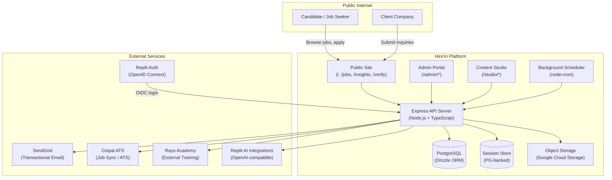

Status: Current-state automated system reference
Generated from: code, schema, routes, configuration, and existing documents
Date: 2026-07-13
Human approval required: Yes — for all UNABLE_TO_CONFIRM items listed within
Unresolved items: 2 — see OWNER_REVIEW_REQUIRED sections within

---

# System Landscape

## What the Platform Is

Hire'in Solutions is an AI-powered staffing and talent acquisition platform serving a professional staffing agency that operates across four service verticals: Healthcare recruitment, IT/Software recruitment, Engineering and Technical recruitment, and Non-IT Professional Services.

The platform comprises two distinct surfaces:

1. A public-facing marketing and job-board website serving candidates and client companies seeking staffing services.
2. A private admin portal serving internal staff across all organizational roles — employees, managers, HR, finance, operations, recruitment, and executive leadership.

The platform's stated business purpose is to streamline recruitment pipelines, enhance candidate matching, and provide full HR lifecycle management for the agency's own workforce. `CONFIRMED_IN_EXISTING_GUIDE`

---

## Four Service Verticals

`CONFIRMED_IN_CODE` — confirmed via `client/src/App.tsx` routes `/services/healthcare-recruitment`, `/services/it-software`, `/services/engineering-technical`, `/services/non-it-professional` and corresponding page components.

| Vertical | Route | Notes |
|---|---|---|
| Healthcare Recruitment | `/services/healthcare-recruitment` | Core vertical; dedicated marketing page and job filtering |
| IT / Software | `/services/it-software` | Includes dedicated IT Staffing landing (`/it-staffing`) |
| Engineering & Technical | `/services/engineering-technical` | |
| Non-IT Professional Services | `/services/non-it-professional` | |

---

## Two Portals

### Public Site

Entry points: `/`, `/about`, `/contracts`, `/jobs`, `/jobs/:id`, `/insights`, `/contact`, `/services/*`, `/verify`, `/capability-deck`, and additional content pages. No authentication required. `CONFIRMED_IN_CODE`

Key public functionality:
- Job board with listings sourced from Ceipal ATS or CSV uploads
- Job application submission with resume upload
- Contact inquiry form (staffing inquiries and employer inquiries)
- Published content (Insights blog articles produced by Content Studio)
- Public document verification (`/verify`) — reference number and auth code lookup for HR letters
- Candidate offer acceptance (`/onboard/:token`) and addendum acceptance (`/addendum/:token`) — token-gated, no account required
- Client contract signing (`/contracts/sign/:token`) — token-gated

### Admin Portal

Entry point: `/admin/login`. Requires authenticated session with valid admin user record and, in production, mandatory TOTP 2FA. `CONFIRMED_IN_CODE`

The portal root (`/admin`) redirects based on role to the My Desk view. Covers the full HR lifecycle, recruitment management, content creation, payroll, and finance.

---

## Environments and Domains

`UNABLE_TO_CONFIRM — OWNER REVIEW REQUIRED`: The production domain name(s), staging environment URL(s), and CDN configuration cannot be confirmed from application code alone. The confirmed sender domain is `hire-in.com` (SendGrid domain authentication verified as of 2026-05-01). `CONFIRMED_IN_EXISTING_GUIDE`

The application is deployed on Replit. The `PORTAL_BASE_URL` environment variable is read by `server/portalUrl.ts` to construct email deep-links and external-facing URLs. `CONFIRMED_IN_CODE`

---

## Confirmed External Services

### Ceipal ATS `CONFIRMED_IN_CODE`

Referenced in `server/ceipalService.ts`. Active code paths: job synchronization via `syncCeipalJobs()` and applicant push via `pushApplicantToCeipal()`. Authentication uses a cached Bearer token derived from email, password, and API key credentials (`CEIPAL_EMAIL`, `CEIPAL_PASSWORD`, `CEIPAL_API_KEY` environment variables). Token is refreshed every 55 minutes. Data exchange: job listings (JSON/XML received), candidate records pushed (name, email, phone, LinkedIn, base64-encoded resume).

### SendGrid `CONFIRMED_IN_CODE`

Referenced in `server/email.ts`. Uses `@sendgrid/mail` SDK. Authentication via `SENDGRID_API_KEY_NEW` environment variable. Confirmed sender: `alina.carter@hire-in.com`. Domain authentication verified for `hire-in.com` as of 2026-05-01. `CONFIRMED_IN_EXISTING_GUIDE` (docs/ops/sendgrid-sender-verification.md). Sends all transactional emails: welcome, password reset, offer letters, salary slips, HR letters, onboarding notifications, leave decisions, and system alerts.

### Google Cloud Storage `CONFIRMED_IN_CODE`

Referenced in `server/replit_integrations/object_storage/objectStorage.ts` and `routes.ts`. Uses `@google-cloud/storage` package. Handles file uploads for: resumes, employee documents, HR letter PDFs, addendum DOCX files, offer letter files, and social card images. Presigned URLs are generated for client-side upload and controlled retrieval. Object storage routes are authentication-gated.

### Rayo Academy `CONFIRMED_IN_CODE`

Referenced in `server/rayoAcademyClient.ts`. An external training platform operated separately from Hire'in. Integration is thin-client: Hire'in provisions employees via API, assigns learning tracks, and retrieves progress summaries. API credentials (`rayo_academy_api_url`, `rayo_academy_api_key`) are stored in the `system_settings` database table rather than environment variables. Graceful fallback: if the API is unavailable or disabled, the client falls back to local database lookups. API calls use a 10-second timeout.

### Replit Auth (OpenID Connect) `CONFIRMED_IN_CODE`

Referenced as an installed Replit integration (`javascript_log_in_with_replit==2.0.0`). Provides an alternative login path alongside the native email/password system. The `openid-client` package is present in `package.json`.

### Replit AI Integrations `CONFIRMED_IN_CODE`

Referenced in `server/services/aiDraftService.ts`, `server/replit_integrations/chat/routes.ts`, `server/bdDecksRoutes.ts`, `server/scheduler.ts`. Uses an OpenAI-compatible endpoint via `AI_INTEGRATIONS_OPENAI_API_KEY` and `AI_INTEGRATIONS_OPENAI_BASE_URL` environment variables. Powers Content Studio article generation, social kit creation, quality review, BD agent chat, and release notes generation. Model tiers: economy (`gpt-5-mini`), standard and strong (`gpt-5.4`).

### Google Fonts `CONFIRMED_IN_EXISTING_GUIDE`

Referenced in `replit.md`. Used for typography. `UNABLE_TO_CONFIRM — OWNER REVIEW REQUIRED`: The specific font families loaded and whether they are self-hosted or fetched from Google's CDN cannot be confirmed without reading all CSS/HTML files.

### Unsplash `CONFIRMED_IN_EXISTING_GUIDE`

Referenced in `replit.md` for hero carousel images on the public site. No server-side Unsplash API integration was found in active code; images appear to be direct URL references or embedded at build time.

---

## Technology Stack

All versions confirmed from `package.json`. `CONFIRMED_IN_CODE`

### Frontend

| Technology | Package | Version |
|---|---|---|
| React | `react` | 18.3.1 |
| TypeScript | `typescript` | 5.6.3 |
| Vite (build tool) | `vite` | 7.3.0 |
| Tailwind CSS | `tailwindcss` | 3.4.17 |
| Shadcn/ui (Radix primitives) | `@radix-ui/*` | Various (see package.json) |
| TanStack Query (state/data fetching) | `@tanstack/react-query` | 5.60.5 |
| Wouter (client routing) | `wouter` | 3.3.5 |
| React Hook Form | `react-hook-form` | 7.55.0 |
| Zod (validation) | `zod` | 3.25.76 |
| Recharts (charts) | `recharts` | 2.15.2 |
| Framer Motion (animation) | `framer-motion` | 11.13.1 |
| Lucide React (icons) | `lucide-react` | 0.453.0 |
| React Icons | `react-icons` | 5.4.0 |

### Backend

| Technology | Package | Version |
|---|---|---|
| Node.js runtime | — | — |
| Express.js | `express` | 5.0.1 |
| TypeScript execution | `tsx` | 4.20.5 |
| PostgreSQL client | `pg` | 8.16.3 |
| Drizzle ORM | `drizzle-orm` | 0.39.3 |
| Drizzle Kit (schema push) | `drizzle-kit` | 0.31.8 |
| drizzle-zod (schema validation) | `drizzle-zod` | 0.7.1 |
| Express Session | `express-session` | 1.19.0 |
| PG Session Store | `connect-pg-simple` | 10.0.0 |
| bcryptjs | `bcryptjs` | 3.0.3 |
| TOTP | `otpauth` | 9.5.0 |
| QR Code | `qrcode` | 1.5.4 |
| Multer (file uploads) | `multer` | 2.0.2 |
| node-cron (scheduling) | `node-cron` | 4.2.1 |
| CSV Parse | `csv-parse` | 6.1.0 |
| ExcelJS | `exceljs` | 4.4.0 |
| XLSX | `xlsx` | 0.18.5 |
| PDFKit | `pdfkit` | 0.18.0 |
| jsPDF | `jspdf` | 4.2.1 |
| DOCX | `docx` | 9.6.0 |
| Docxtemplater | `docxtemplater` | 3.68.7 |
| Puppeteer Core | `puppeteer-core` | 24.43.1 |
| OpenAI SDK | `openai` | 6.43.0 |
| OpenID Client | `openid-client` | 6.8.1 |
| Passport | `passport` | 0.7.0 |
| SendGrid Mail | `@sendgrid/mail` | 8.1.3 |
| Google Cloud Storage | `@google-cloud/storage` | 7.18.0 |
| Passport Local | `passport-local` | 1.0.0 |
| PPTXGenJS | `pptxgenjs` | 4.0.1 |

---

## System Context Diagram

