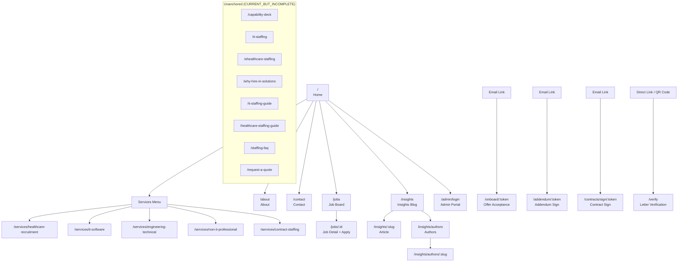

Status: Current-state practitioner reference
Generated from: client/src/App.tsx (PublicRouter), Phase 1 SYSTEM_LANDSCAPE.md
Date: 2026-07-13
Human approval required: Yes — for all UNABLE_TO_CONFIRM items listed within
Unresolved items: 3

---

# Hire'in Website Sitemap

All routes confirmed from `client/src/App.tsx` (PublicRouter). Navigation entries confirmed where a corresponding nav component or page reference exists. Routes present in the router but without a confirmed nav entry are flagged `CURRENT_BUT_INCOMPLETE`.

---

## Confirmed Public Pages

| URL | Page Purpose | Intended Audience | Navigation Entry Confirmed | Status |
|---|---|---|---|---|
| `/` | Marketing landing page | General public, candidates, clients | Yes — home link | Active |
| `/about` | Company overview | General public | Yes — About nav | Active |
| `/jobs` | Public job board | Candidates | Yes — Jobs nav | Active |
| `/jobs/:id` | Individual job detail and apply | Candidates | Linked from `/jobs` | Active |
| `/contact` | General inquiry and lead capture form | Candidates, clients | Yes — Contact nav | Active |
| `/insights` | Published content blog | General public | Yes — Insights nav | Active |
| `/insights/:slug` | Individual article | General public | Linked from `/insights` | Active |
| `/insights/authors` | Article author directory | General public | Linked from article | Active |
| `/insights/authors/:slug` | Individual author profile | General public | Linked from article | Active |
| `/services/healthcare-recruitment` | Healthcare staffing vertical page | Clients, candidates | Yes — Services nav | Active |
| `/services/it-software` | IT/software staffing vertical page | Clients, candidates | Yes — Services nav | Active |
| `/services/engineering-technical` | Engineering staffing vertical page | Clients, candidates | Yes — Services nav | Active |
| `/services/non-it-professional` | Non-IT professional services | Clients, candidates | Yes — Services nav | Active |
| `/services/contract-staffing` | Contract staffing offering | Clients, candidates | Yes — Services nav | Active |
| `/capability-deck` | Company capability presentation | Clients | `CURRENT_BUT_INCOMPLETE` — in router, no confirmed main-nav entry |  Active |
| `/it-staffing` | IT staffing dedicated landing page | Clients, candidates | `CURRENT_BUT_INCOMPLETE` — in router, no confirmed main-nav entry | Active |
| `/ehealthcare-staffing` | eHealthcare staffing landing page | Clients, candidates | `CURRENT_BUT_INCOMPLETE` — in router, no confirmed main-nav entry | Active |
| `/why-hire-in-solutions` | Why choose Hire'in page | Clients | `CURRENT_BUT_INCOMPLETE` — in router, no confirmed main-nav entry | Active |
| `/it-staffing-guide` | IT staffing guide content | Candidates, clients | `CURRENT_BUT_INCOMPLETE` — in router, no confirmed main-nav entry | Active |
| `/healthcare-staffing-guide` | Healthcare staffing guide content | Candidates | `CURRENT_BUT_INCOMPLETE` — in router, no confirmed main-nav entry | Active |
| `/staffing-faq` | Frequently asked questions | General public | `CURRENT_BUT_INCOMPLETE` — in router, no confirmed main-nav entry | Active |
| `/request-a-quote` | Quote request form | Clients | `CURRENT_BUT_INCOMPLETE` — in router, no confirmed main-nav entry | Active |
| `/contracts` | Contracts & Clients marketing page | Clients, general public | `CURRENT_BUT_INCOMPLETE` — in router, no confirmed main-nav entry | Active |
| `/terms` | Terms of service | General public | Footer link | Active |
| `/privacy` | Privacy policy | General public | Footer link | Active |
| `/verify` | HR letter public verification | General public, employees | Direct link only | Active |
| `/onboard/:token` | Candidate offer acceptance | Candidates (token-gated) | Email link only | Active |
| `/addendum/:token` | Employee addendum countersign | Employees (token-gated) | Email link only | Active |
| `/contracts/sign/:token` | Client contract signing | Clients (token-gated) | Email link only | Active |

---

## Admin Entry Points (Non-Public but Accessible)

| URL | Purpose | Auth Required |
|---|---|---|
| `/admin/login` | Admin portal login | No (pre-auth) |
| `/admin/forgot-password` | Password reset request | No (pre-auth) |
| `/admin/reset-password` | Password reset completion | Token-gated |

---

## Navigation Hierarchy Diagram

---

## Unresolved Navigation Items

`UNABLE_TO_CONFIRM — OWNER REVIEW REQUIRED` — The following routes appear in the router but have no confirmed main navigation or footer entry. They may be reachable via deep links, marketing campaigns, or linked from other pages. Owner should confirm whether they are intended to be discoverable via the site navigation.

1. `/contracts` — Contracts & Clients marketing page
2. `/capability-deck` — Company capability presentation
3. `/it-staffing` — IT staffing dedicated landing
4. `/ehealthcare-staffing` — eHealthcare staffing landing
5. `/why-hire-in-solutions` — Why Hire'in page
6. `/it-staffing-guide` — IT staffing guide
7. `/healthcare-staffing-guide` — Healthcare staffing guide
8. `/staffing-faq` — Staffing FAQ
9. `/request-a-quote` — Quote request form
