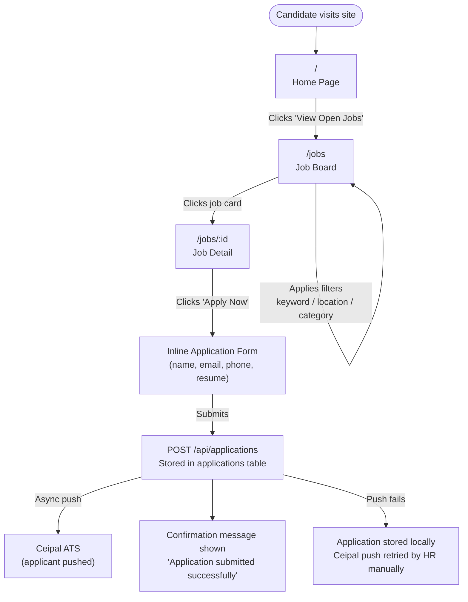
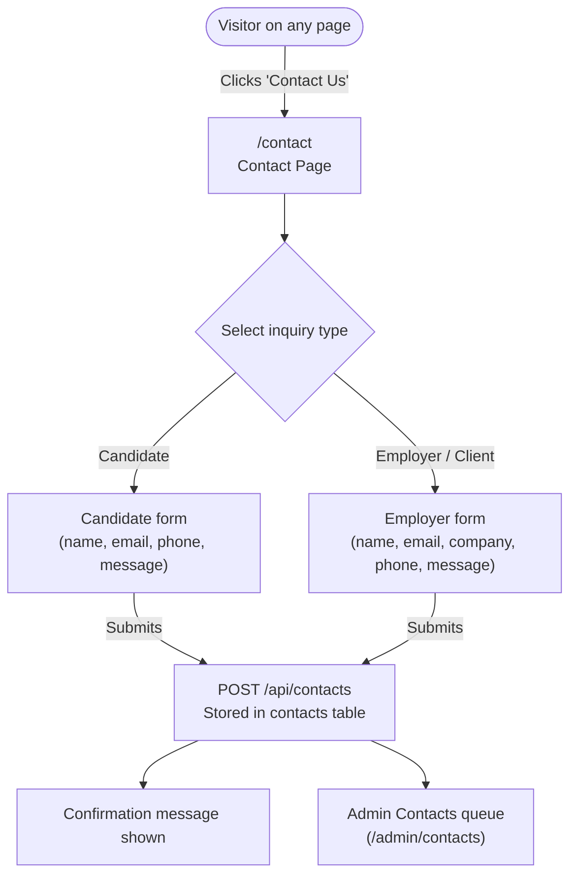
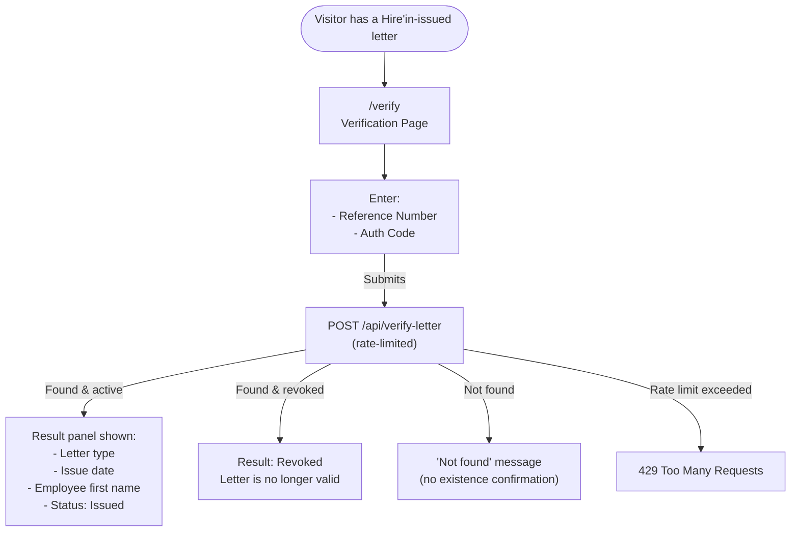
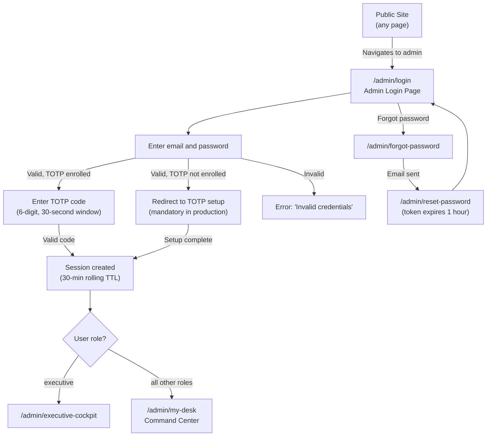
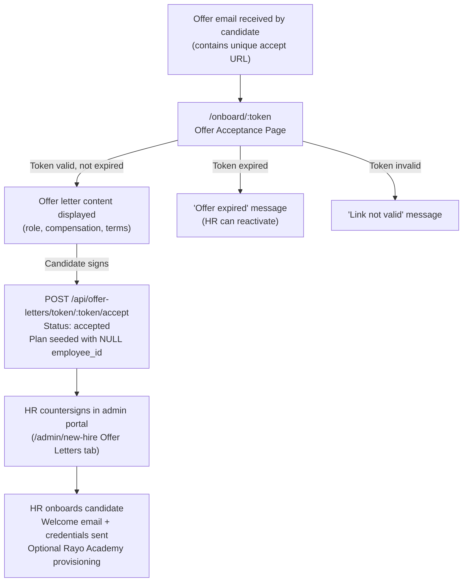

Status: Current-state practitioner reference
Generated from: client/src/App.tsx, Phase 1 SYSTEM_LANDSCAPE.md, PRODUCT_CAPABILITY_MAP.md, WORKFLOW_STATE_MACHINES.md
Date: 2026-07-13
Human approval required: Yes — for all UNABLE_TO_CONFIRM items listed within
Unresolved items: 1

---

# Website User Flows

Flow diagrams for confirmed user journeys through the public site and the public-to-portal entry point. All flows are confirmed from `client/src/App.tsx` and route/API behavior documented in Phase 1. No speculative flows are included.

---

## Flow 1: Job Seeker Journey

A candidate discovers open positions, reads a job description, and submits an application. The application is stored and pushed to Ceipal ATS.

**Confirmed steps:**
- `/jobs` calls `GET /api/jobs` — returns all active jobs. `CONFIRMED_IN_ROUTE`
- Application submit calls `POST /api/applications` — stores in `applications` table. `CONFIRMED_IN_ROUTE`
- Ceipal push via `pushApplicantToCeipal()` in `server/ceipalService.ts` — called asynchronously on submit. `CONFIRMED_IN_CODE`
- Failed Ceipal pushes are flagged in the admin Recruitment view for manual retry. `CONFIRMED_IN_CODE`

---

## Flow 2: Candidate or Client Contact / Inquiry Flow

A visitor — either a job seeker or a prospective client — submits an inquiry through the Contact form. The inquiry is stored and routed to the appropriate team.

**Confirmed steps:**
- Contact form submits to `POST /api/contacts`. `CONFIRMED_IN_ROUTE`
- Submission stored in `contacts` table. `CONFIRMED_IN_SCHEMA`
- Admin views inquiries at `/admin/contacts` filtered by status and type. `CONFIRMED_IN_ROUTE`

---

## Flow 3: Public Letter Verification Flow

A member of the public — typically a new employer or government body — verifies the authenticity of an HR letter or contract using details printed on the document.

**Confirmed steps:**
- `/verify` is a public, no-auth route. `CONFIRMED_IN_ROUTE`
- `POST /api/verify-letter` is rate-limited. `CONFIRMED_IN_CODE`
- Returns letter type, issue date, and employee first name — no full PII returned. `CONFIRMED_IN_CODE`
- Covers `hr_letter` and `contract` document types only — offer letters are not verifiable via this endpoint. `CONFIRMED_IN_CODE`
- Revoked letters return a revoked status — the endpoint does not return 404 for revoked. `CONFIRMED_IN_CODE`

---

## Flow 4: Website to Admin Portal Entry (Login and Registration)

A new admin user or returning staff member navigates from the public site to the admin portal. No self-registration is available — accounts are created by HR/admin.

**Confirmed steps:**
- Login submits to `POST /api/auth/login`. `CONFIRMED_IN_CODE`
- Email domain checked against `allowed_email_domains` setting (default `hire-in.com`). `CONFIRMED_IN_CODE`
- TOTP mandatory in `NODE_ENV === 'production'`. In development, TOTP is bypassed. `CONFIRMED_IN_CODE`
- TOTP algorithm: SHA1, 6-digit, 30-second period, 1-step window tolerance. `CONFIRMED_IN_CODE`
- `executive` role redirects to `/admin/executive-cockpit`; all others go to `/admin/my-desk`. `CONFIRMED_IN_CODE`
- Session TTL: 30 minutes, rolling. `CONFIRMED_IN_CODE`
- Password reset token: 32-byte random, 1-hour expiry. `CONFIRMED_IN_CODE`
- No self-registration flow exists — accounts are created by HR/admin via `POST /api/users`. `CONFIRMED_IN_CODE`

---

## Flow 5: Candidate Offer Acceptance Flow

After receiving an offer email, a candidate accepts or views the offer via a token-gated URL. This is part of the recruitment-to-hire pipeline.

**Confirmed steps:**
- `GET /api/offer-letters/token/:token` validates token, checks expiry. `CONFIRMED_IN_CODE`
- Acceptance records a probation or growth plan with NULL `employee_id`. `CONFIRMED_IN_CODE`
- Counter-signature stores a cryptographic document hash. `CONFIRMED_IN_CODE`
- Onboarding sends a welcome email with credentials via SendGrid. `CONFIRMED_IN_CODE`
- Offer letter viewing is tracked — `viewedAt` timestamp is set when candidate first opens the link. `CONFIRMED_IN_CODE`
