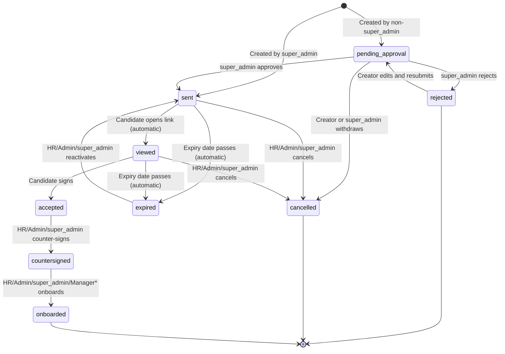
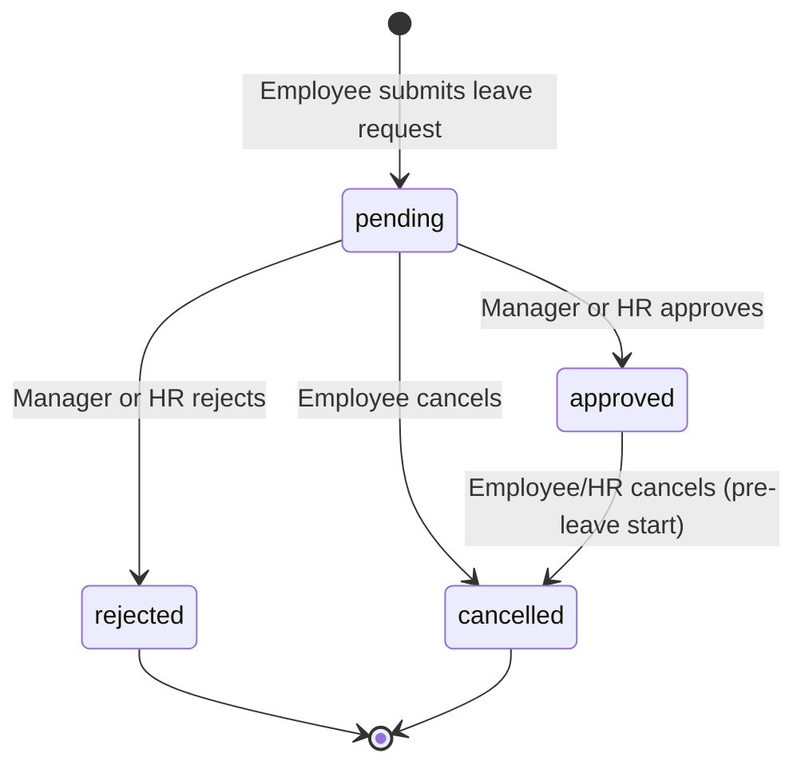
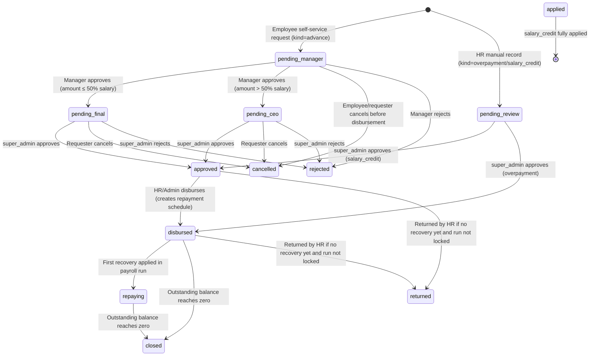
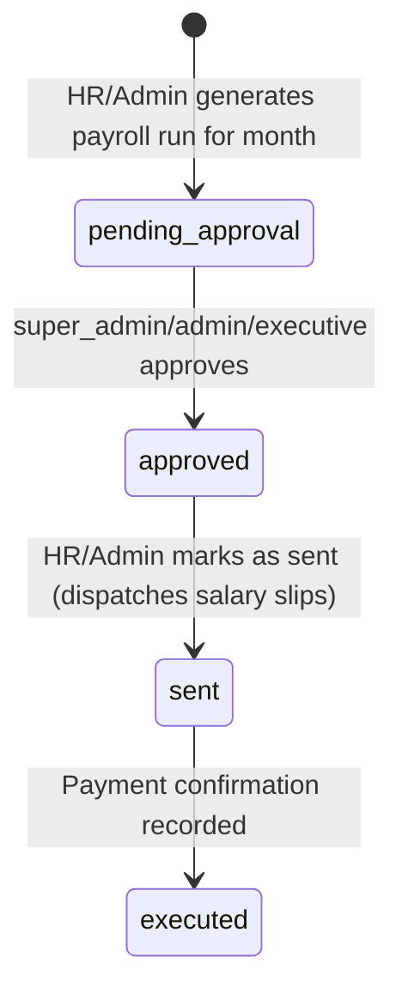
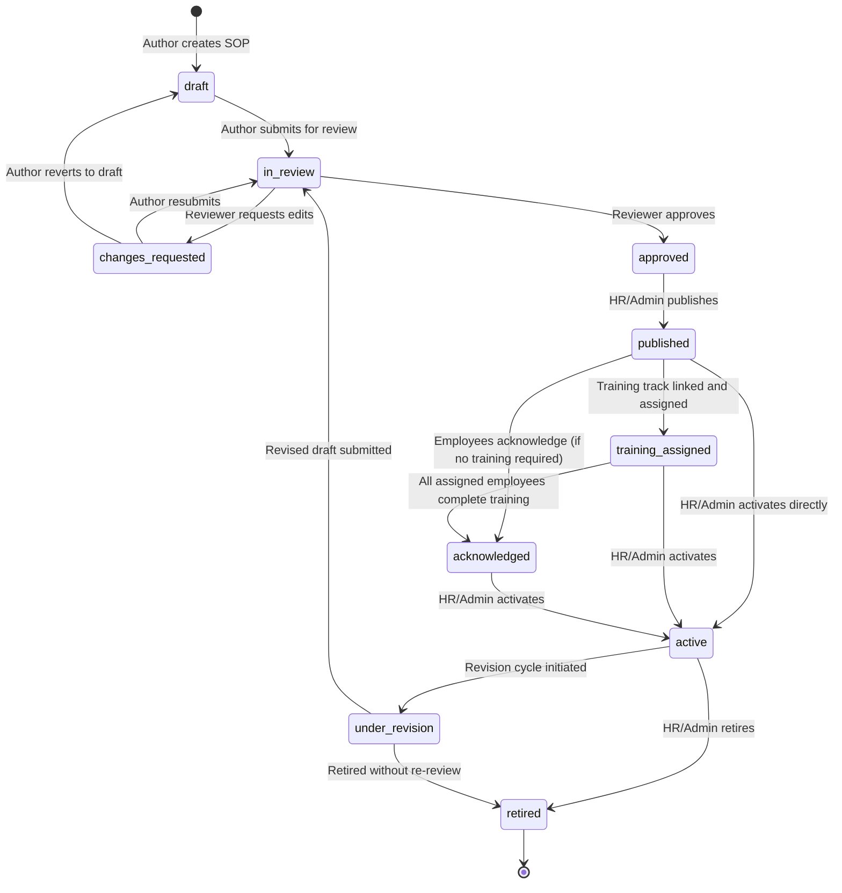
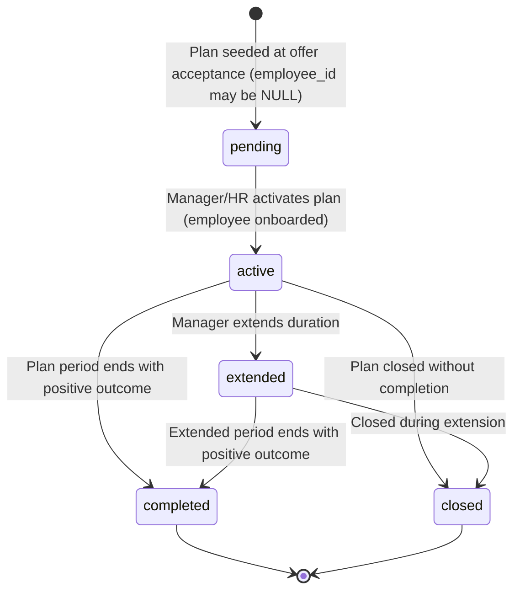
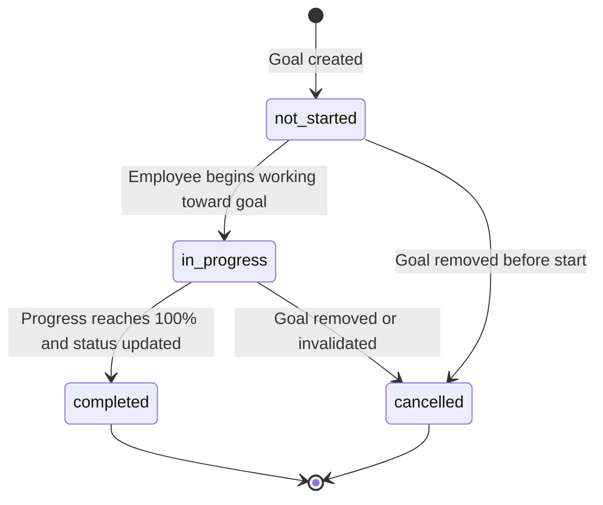
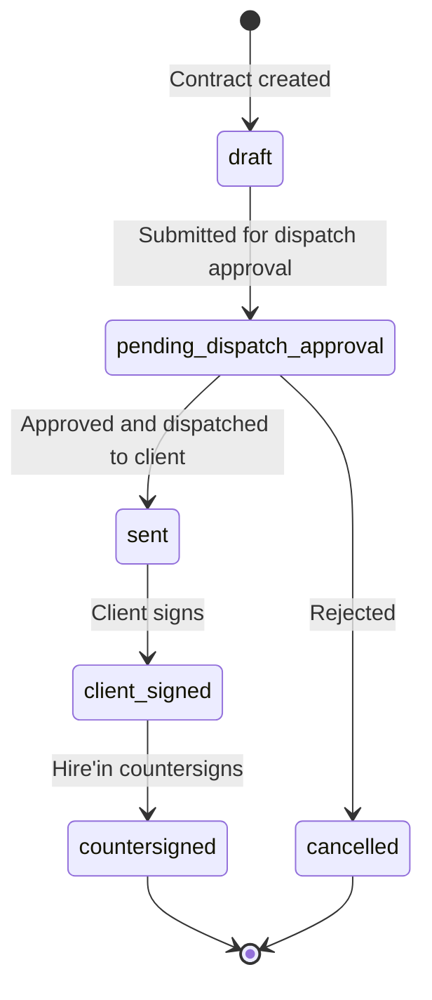
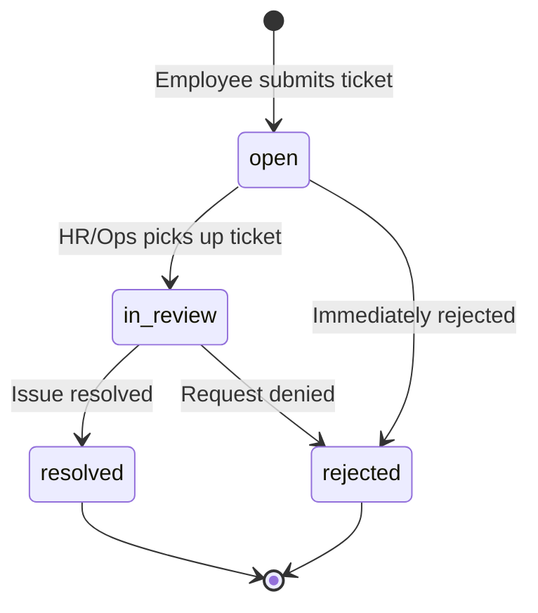

Status: Current-state automated system reference
Generated from: code, schema, routes, configuration, and existing documents
Date: 2026-07-13
Human approval required: Yes — for all UNABLE_TO_CONFIRM items listed within
Unresolved items: 0

---

# Workflow State Machines

This document describes every formal status lifecycle in the platform. Each state machine entry shows: all valid status values, all valid transitions, who can trigger each transition, system effects, and any guards or prerequisites.

---

## 1. Offer Letter Lifecycle

`CONFIRMED_IN_CODE` — `server/offerLetter.ts`, `server/routes.ts`

**Status values:** `pending_approval`, `sent`, `viewed`, `accepted`, `countersigned`, `onboarded`, `rejected`, `cancelled`, `expired`

*Managers can only trigger the `onboarded` transition for offers they originally created.

| Transition | Trigger | Actor | Side Effects |
|---|---|---|---|
| None → `pending_approval` | Create offer | Manager, HR | Email to super_admin; in-app notification to all super_admins |
| None → `sent` | Create offer | super_admin | Email to candidate with accept URL |
| `pending_approval` → `sent` | Approve | super_admin | Email to candidate with accept URL; decision email to creating manager; in-app notification to manager |
| `pending_approval` → `rejected` | Reject | super_admin | Rejection decision email to manager; in-app notification to manager |
| `pending_approval` → `cancelled` | Withdraw | Creator, super_admin | No email |
| `rejected` → `pending_approval` | Edit + resubmit | Creator, super_admin | Re-triggers pending_approval notification cycle |
| `sent` → `viewed` | Candidate opens link | Candidate (automatic) | No notification; `viewedAt` timestamp set |
| `sent`/`viewed` → `cancelled` | Cancel | HR, admin, super_admin | No candidate notification confirmed |
| `sent`/`viewed` → `expired` | Expiry passes | System scheduler | Expiry reminder email before expiry; status set to expired on access |
| `expired` → `sent` | Reactivate | HR, admin, super_admin | Resends offer email to candidate with new expiry |
| `sent`/`viewed` → `accepted` | Candidate signs | Candidate | Audit log written; probation/growth plan seeded with NULL employee_id |
| `accepted` → `countersigned` | Counter-sign | HR, admin, super_admin | Document hash stored |
| `countersigned` → `onboarded` | Onboard | HR, admin, super_admin, Manager (own) | Welcome email with credentials; optional Rayo Academy provisioning |

**Guards:**
- Non-super_admin creators cannot send directly — letter is locked to `pending_approval`.
- The super_admin is hard-coded as the sole approval authority.

---

## 2. Leave Request Lifecycle

`CONFIRMED_IN_SCHEMA` — `shared/schema.ts` `leave_status` enum. `CONFIRMED_IN_CODE` — `server/routes.ts` leave routes.

**Status values:** `pending`, `approved`, `rejected`, `cancelled`

| Transition | Actor | Side Effects |
|---|---|---|
| None → `pending` | Employee (all roles) | Email notification to manager/HR; in-app notification |
| `pending` → `approved` | Manager (own team), HR, admin, super_admin | Email to employee; leave balance deducted; in-app notification |
| `pending` → `rejected` | Manager (own team), HR, admin, super_admin | Email to employee with reason; in-app notification |
| `pending` → `cancelled` | Employee (own request), HR, admin, super_admin | Leave balance not affected |
| `approved` → `cancelled` | Employee, HR, admin, super_admin | Leave balance restored |

**Guards:**
- Managers may only approve/reject leave for their direct reports.
- LWP gating: if an employee applies for leave beyond their balance, the system calculates LWP (Leave Without Pay) days and splits the request automatically.
- Weekend and holiday exclusion: leave days do not count weekends or company holidays as leave days.

---

## 3. Attendance and Break Status

`CONFIRMED_IN_SCHEMA` — `shared/schema.ts` `attendance_status` enum. `CONFIRMED_IN_CODE` — `server/routes.ts`

**Attendance status values:** `present`, `absent`, `half_day`, `short_day`, `late`, `on_leave`, `holiday`, `weekend`

| Status | How Set |
|---|---|
| `present` | Employee punches in and out; hours meet threshold |
| `absent` | No punch record for a working day; set by nightly sweep cron |
| `half_day` | Punch hours below half-day threshold but above short_day threshold (shift-specific) |
| `short_day` | Punch hours below short_day threshold (shift-specific) |
| `late` | Punch-in time exceeds grace period; can co-exist with present |
| `on_leave` | Leave request was approved for that day |
| `holiday` | Day is a company holiday |
| `weekend` | Day falls on Saturday or Sunday (per shift definition) |

**Break status (live, not a stored enum):** `on_lunch`, `on_tea`. Derived from active `break_records` with no `end_time` for that break type on the current day. Visible to managers in Team Attendance. `CONFIRMED_IN_CODE`

---

## 4. Salary Advance Lifecycle

`CONFIRMED_IN_SCHEMA` — `shared/schema.ts` `salaryAdvanceStatusEnum`. `CONFIRMED_IN_CODE` — `server/salaryAdvanceRoutes.ts`

**Status values:** `pending_manager`, `pending_final`, `pending_ceo`, `pending_review`, `approved`, `disbursed`, `repaying`, `applied`, `closed`, `rejected`, `cancelled`, `returned`

**Advance kind values:** `advance`, `overpayment`, `salary_credit`

| Transition | Actor | Guard | Side Effects |
|---|---|---|---|
| None → `pending_manager` | Employee (self-service) | `salary_advance_enabled` flag must be ON | Notification to manager |
| None → `pending_review` | super_admin, admin, hr | Works even when self-service flag is OFF | Notification to super_admin for review |
| `pending_manager` → `pending_final` | Manager, HR | Amount ≤ 50% of monthly salary | Notification to super_admin |
| `pending_manager` → `pending_ceo` | Manager, HR | Amount > 50% of monthly salary | Notification to super_admin (CEO escalation) |
| `pending_ceo`/`pending_final` → `approved` | super_admin | — | Notification to employee |
| `pending_review` → `approved` or `disbursed` | super_admin | Kind-dependent | For salary_credit → approved; for overpayment → disbursed |
| `approved` → `disbursed` | HR, admin, super_admin | — | Creates repayment installment schedule in `salary_advance_repayments` |
| `disbursed`/`repaying` → `closed` | System (payroll engine) | Outstanding balance = 0 | Automatic closure on payroll recovery |
| `approved`/`disbursed` → `returned` | HR, admin, super_admin | No recovery payments made; run not locked | Adjustment to outstanding balance |

**Recovery rules:**
- Oldest-first (FIFO): multiple active advances recovered from oldest `created_at` first.
- Shortfall carry-forward: if net pay is insufficient for full recovery, the shortfall remains on the advance and carries to next month.
- Recovery cannot be modified if the targeted payroll run is locked (status not `pending_approval`).

---

## 5. Payroll Run Lifecycle

`CONFIRMED_IN_SCHEMA` — `shared/schema.ts` `salaryReportStatusEnum`. `CONFIRMED_IN_CODE` — payroll routes

**Status values:** `pending_approval`, `approved`, `sent`, `executed`

| Transition | Actor | Side Effects |
|---|---|---|
| None → `pending_approval` | HR, admin, super_admin, executive | Run rows created per employee; India statutory computed |
| `pending_approval` → `approved` | super_admin, admin, executive | Salary slips locked for the period |
| `approved` → `sent` | HR, admin, super_admin | Salary slip PDFs dispatched via email to each employee |
| `sent` → `executed` | HR, admin, super_admin | Per-employee payment marked as deposited (`salary_run_payments`) |

**Guards:**
- Advance recoveries are locked once a run moves past `pending_approval` status — HR must regenerate to include new advances.
- Attendance report must be validated before payroll run generation (soft dependency).

---

## 6. SOP Lifecycle

`CONFIRMED_IN_CODE` — `server/sopGovernance.ts`

**Status values:** `draft`, `in_review`, `changes_requested`, `approved`, `published`, `training_assigned`, `acknowledged`, `active`, `under_revision`, `retired`

**Terminal state:** `retired` — no transitions out.

**Guards:**
- Illegal transitions are blocked by the `TRANSITIONS` record in `server/sopGovernance.ts`. Any transition not in the allowed map returns a 400 error.
- Locked published/active versions clone a new draft on edit rather than modifying in place (content immutability).
- SOP compliance enforcement is gated by the wave rollout system (see SOP Wave Rollout below).

---

## 7. SOP Employee Progress Lifecycle

`CONFIRMED_IN_CODE` — `server/sopRollout.ts`

This is not a status-enum machine but a progression tracked by timestamp fields on `sop_employee_progress`. `CONFIRMED_IN_SCHEMA`

| State | Condition |
|---|---|
| Unstarted | No row in `sop_employee_progress` for this (sopMasterId, userId) |
| Training underway | Row exists; `trainingCompletedAt` is NULL |
| Training complete | `trainingCompletedAt` is set; `acknowledgedAt` is NULL |
| Acknowledged | `acknowledgedAt` is set; `acknowledgmentHash` stored |

**Compliance lock trigger (all conditions must be true simultaneously):**
1. SOP belongs to a wave with `full` enforcement level
2. SOP is currently operational (past its activation date)
3. More than 15 days (`SOP_ACK_GRACE_DAYS`) have elapsed since the SOP became operational
4. The employee has not yet acknowledged the current version

When all four conditions are true, the employee is redirected to `/admin/policy-gate` on any admin portal access. `CONFIRMED_IN_CODE`

---

## 8. Employee Plan Lifecycle (Probation / Growth / PIP)

`CONFIRMED_IN_SCHEMA` — `shared/schema.ts` `employeePlanStatusEnum`, `employeePlanOutcomeEnum`. `CONFIRMED_IN_CODE` — `server/performanceRoutes.ts`

**Plan type values:** `probation`, `growth`, `pip`

**Status values:** `pending`, `active`, `completed`, `extended`, `closed`

**Outcome values:** `confirmed`, `extended`, `released`, `passed`, `terminated`, `rolled_over`

**Check-in cadence (Probation):** 8 check-ins auto-generated at Days 1, 7, 15, 30, 45, 60, 75, 90.
- Days 30, 60, 90: formal milestone reviews with `reviewScores` JSONB and scoring bands.
- Other days: lightweight pulse reviews.

**Check-in cadence (PIP):** Weekly `pip_review` check-ins auto-generated for the plan duration (default 30 days).

**Escalation thresholds:**
- 3 missed check-ins: `strikeEscalatedAt` set on the plan; HR/super_admin notified.
- Day 30/60 milestone missed: `milestoneEscalatedAt` set; escalation email dispatched.

**Audit trail:** All transitions logged to `audit_logs` via `createAuditLog`. New values captured; old values not captured (pre-update values not stored). `CONFIRMED_IN_EXISTING_GUIDE` — noted as the primary gap in `docs/ai-governance-audit/GOVERNANCE-MVP-READINESS.md`.

---

## 9. Performance Goal Lifecycle

`CONFIRMED_IN_SCHEMA` — `shared/schema.ts` `performanceGoalStatusEnum`. `CONFIRMED_IN_CODE` — `server/performanceRoutes.ts`

**Status values:** `not_started`, `in_progress`, `completed`, `cancelled`

| Field | Purpose |
|---|---|
| `progress` | Integer 0–100 percent completion |
| `targetDate` | Due date (nullable) |
| `rating` | Integer rating assigned at review (nullable) |
| `linkedSopId` | Link to a specific SOP version for KPI tracking |

---

## 10. Training Assignment Lifecycle

`CONFIRMED_IN_SCHEMA` — `shared/schema.ts` `track_assignments`. `CONFIRMED_IN_CODE` — `server/trainingCatalogRoutes.ts`

**Status values:** `not_started`, `in_progress`, `completed`, `excepted`

| Status | Meaning |
|---|---|
| `not_started` | Assigned but employee has not started |
| `in_progress` | Employee has begun at least one section |
| `completed` | All sections completed, quiz passed, content acknowledged; `completedAt` set |
| `excepted` | HR-granted exception: employee exempt from completing this track. `exceptionGrantedById`, `exceptionGrantedAt`, `exceptionReason` recorded |

**Overdue handling:** `dueDate` is set at assignment time. Scheduler fires daily overdue reminders (tracked via `sop_employee_progress.overdueNudgeSentDate` for SOP-linked tracks). No automatic status change on overdue — status remains `in_progress` or `not_started`. Compliance lock applies separately via the SOP wave engine.

---

## 11. Check-in Lifecycle

`CONFIRMED_IN_SCHEMA` — `shared/schema.ts` `check_ins`. `CONFIRMED_IN_CODE` — `server/performanceRoutes.ts`

**Status values:** `scheduled`, `completed`, `cancelled`

| Status | Meaning |
|---|---|
| `scheduled` | Check-in is upcoming or overdue; no action taken yet |
| `completed` | Manager has completed the check-in; `completedAt` is set |
| `cancelled` | Check-in was removed or invalidated |

**Notification tracking columns on `check_ins`:**
- `notified_at` — day-before employee reminder sent
- `manager_notified_at` — same-day manager reminder sent
- `overdue_reminded_on` — date of last overdue reminder (dedup guard)
- `milestone_escalated_at` — escalation sent for missed milestone

---

## 12. HR Letter Lifecycle

`CONFIRMED_IN_CODE` — `server/routes.ts` HR letter routes, `server/hrLetterVerification.ts`

**Status values (inferred from code behavior, not a formal enum):** `issued`, `revoked`

| Status | Meaning |
|---|---|
| `issued` | Letter has been generated and signed; reference number and auth code assigned; verifiable via `/verify` |
| `revoked` | Letter has been revoked by HR; verification endpoint returns revoked status |

Letters are issued with a cryptographic auth code. The `/verify` public endpoint returns the letter type, issue date, employee name, and revocation status. `CONFIRMED_IN_CODE`

---

## 13. Contract Lifecycle

`CONFIRMED_IN_SCHEMA` — `shared/schema.ts` `contract_status` enum.

**Status values:** `draft`, `pending_dispatch_approval`, `sent`, `client_signed`, `countersigned`, `cancelled`

---

## 14. Governance Control Lifecycle

`CONFIRMED_IN_SCHEMA` — `shared/schema.ts` `governance_control_status` enum.

**Status values:** `pending`, `in_progress`, `completed`, `overdue`, `escalated`, `closed`, `disputed`

| Status | Meaning |
|---|---|
| `pending` | Obligation registered but not yet started |
| `in_progress` | Active work on the obligation |
| `completed` | Obligation fulfilled |
| `overdue` | Past due date without completion |
| `escalated` | Escalated to senior management or CEO |
| `closed` | Closed without full completion (may be accepted as-is) |
| `disputed` | Obligation scope or validity is under dispute |

---

## 15. Help Desk Ticket Lifecycle (HIRD)

`CONFIRMED_IN_SCHEMA` — `shared/schema.ts` `ticket_status` enum.

**Status values:** `open`, `in_review`, `resolved`, `rejected`

HIRD also supports a specialized `needs_info` → `returned_for_info` → `responded_to_info` flow for information requests, tracked via audit action types on `internal_request_audit_log`. `CONFIRMED_IN_CODE`

---

## Summary Reference Table

| Entity | Status Enum / Values | Terminal States | Stored In |
|---|---|---|---|
| Offer Letter | `pending_approval`, `sent`, `viewed`, `accepted`, `countersigned`, `onboarded`, `rejected`, `cancelled`, `expired` | `rejected`, `cancelled`, `onboarded` | `offer_letters.status` (varchar) |
| Leave Request | `pending`, `approved`, `rejected`, `cancelled` | `rejected` | `leave_requests.status` (pgEnum) |
| Attendance Record | `present`, `absent`, `half_day`, `short_day`, `late`, `on_leave`, `holiday`, `weekend` | None (daily records) | `attendance.status` (pgEnum) |
| Salary Advance | `pending_manager`, `pending_final`, `pending_ceo`, `pending_review`, `approved`, `disbursed`, `repaying`, `applied`, `closed`, `rejected`, `cancelled`, `returned` | `closed`, `rejected`, `cancelled` | `salary_advance_requests.status` (pgEnum) |
| Payroll Run | `pending_approval`, `approved`, `sent`, `executed` | `executed` | `salary_report_runs.status` (pgEnum) |
| SOP Document | `draft`, `in_review`, `changes_requested`, `approved`, `published`, `training_assigned`, `acknowledged`, `active`, `under_revision`, `retired` | `retired` | `sop_documents.status` (varchar) |
| Employee Plan | `pending`, `active`, `completed`, `extended`, `closed` | `completed`, `closed` | `employee_plans.status` (pgEnum) |
| Performance Goal | `not_started`, `in_progress`, `completed`, `cancelled` | `completed`, `cancelled` | `performance_goals.status` (pgEnum) |
| Training Assignment | `not_started`, `in_progress`, `completed`, `excepted` | `completed`, `excepted` | `track_assignments.status` (varchar) |
| Check-in | `scheduled`, `completed`, `cancelled` | `completed`, `cancelled` | `check_ins.status` (varchar) |
| HR Letter | `issued`, `revoked` | `revoked` | `hr_letters` (status field) |
| Contract | `draft`, `pending_dispatch_approval`, `sent`, `client_signed`, `countersigned`, `cancelled` | `countersigned`, `cancelled` | `contracts.status` (pgEnum) |
| Governance Control | `pending`, `in_progress`, `completed`, `overdue`, `escalated`, `closed`, `disputed` | `completed`, `closed` | `governance_controls.status` (pgEnum) |
| Help Desk Ticket | `open`, `in_review`, `resolved`, `rejected` | `resolved`, `rejected` | `tickets.status` (pgEnum) |
